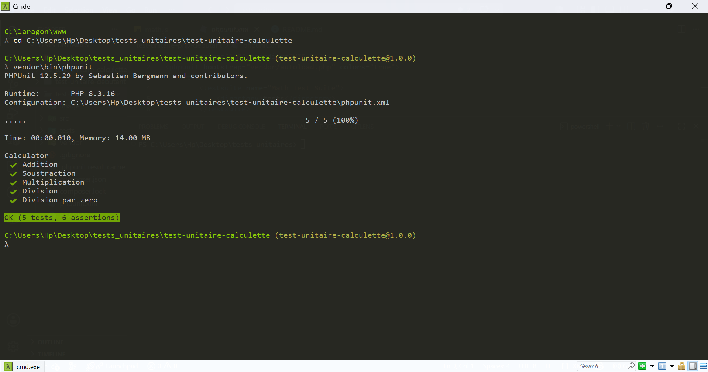
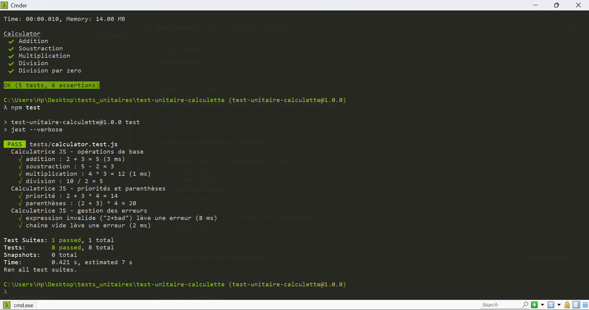

# Test Unitaire — Calculette (PHP + JS)

Tests unitaires sur deux calculettes existantes :
- **PHP** (classe `Calculator`) testée avec **PHPUnit**
- **JavaScript** (fonction `calculate()`) testée avec **Jest**

## Structure

```
test-unitaire-calculette/
├── calculator.php          ← classe PHP Calculator (fournie)
├── calculator.js           ← fonction JS calculate (fournie)
├── calculator.css
├── Calculator_PHP.php      ← UI web PHP (fournie)
├── Calculator_JS.html      ← UI web JS (fournie)
├── tests/
│   ├── CalculatorTest.php  ← tests PHPUnit
│   └── calculator.test.js  ← tests Jest
├── phpunit.xml
├── composer.json
├── package.json
└── image/
```

## Installation

```bash
composer install        # PHPUnit
npm install             # Jest
```

## Tests PHP (PHPUnit)

**Cas testés :**
- addition `2+3 = 5`
- soustraction `5-2 = 3`
- multiplication `4*3 = 12`
- division `10/2 = 5`
- **division par zéro** → exception `Erreur de calcul`

**Lancer :**
```bash
vendor\bin\phpunit
```



## Tests JS (Jest)

**Cas testés :**
- addition `2+3 = 5`
- soustraction `5-2 = 3`
- multiplication `4*3 = 12`
- division `10/2 = 5`
- priorités `2+3*4 = 14`
- parenthèses `(2+3)*4 = 20`
- expression invalide `2+bad` → erreur `Expression invalide`
- **bonus** : chaîne vide `''` → erreur `Expression invalide`

**Lancer :**
```bash
npm test
```



## Bilan

- PHPUnit : `assertEquals` pour les calculs, `expectException` pour la division par zéro.
- Jest : `toBe` pour les calculs, `toThrow` pour les erreurs.
- Tous les tests passent → la logique métier des deux calculettes est validée.
