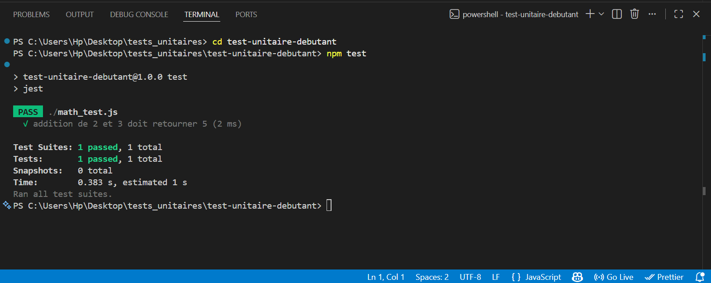
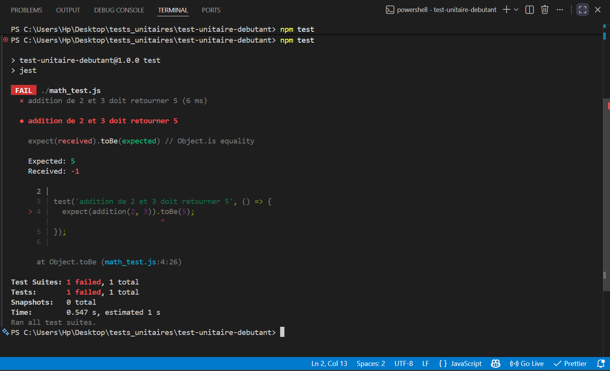
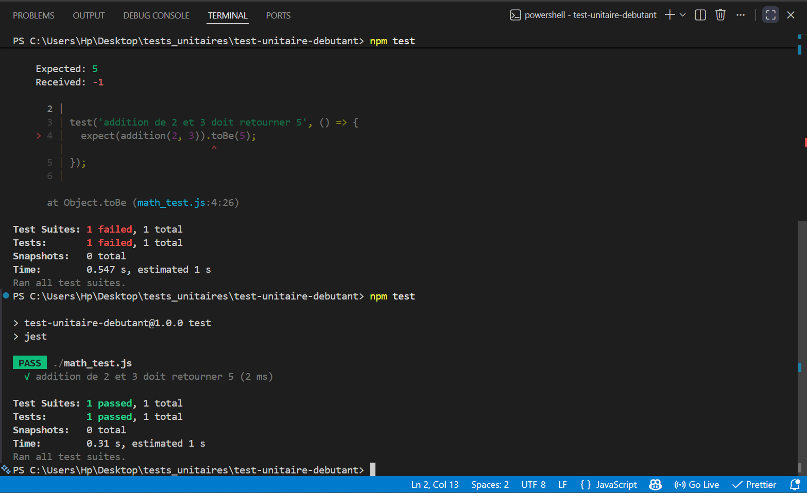

## Lancer

```bash
npm test
```

### 1. Test réussi



### 2. Test raté (j'ai mis `a - b` à la place de `a + b`)



→ Jest détecte l'erreur : `Expected: 5`, `Received: -1`.

### 3. Test corrigé



## Bilan

- `test()` + `expect().toBe()` = base de Jest.
- Le test échoue dès que la fonction change → utile pour détecter les régressions.
