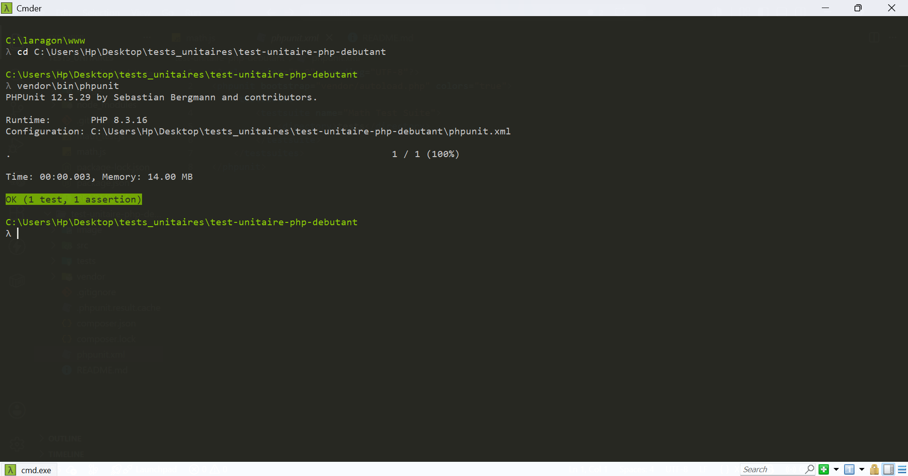
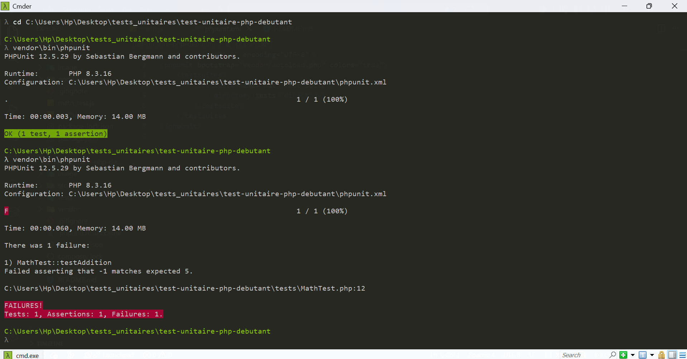
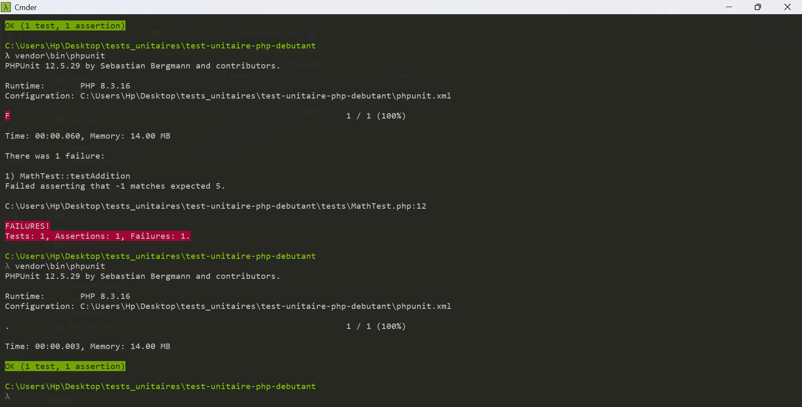

# Test Unitaire PHP Débutant

Premier projet de tests unitaires — **PHP + Composer + PHPUnit**.

## Installation

```bash
composer init --no-interaction
composer require --dev phpunit/phpunit
```

## Structure

```
test-unitaire-php-debutant/
├── src/
│   └── Math.php
├── tests/
│   └── MathTest.php
├── phpunit.xml
├── composer.json
└── vendor/   (ignoré par git)
```

## Code

**`src/Math.php`** — la classe :

```php
<?php
class Math
{
    public function addition($a, $b)
    {
        return $a + $b;
    }
}
```

**`tests/MathTest.php`** — le test :

```php
<?php
use PHPUnit\Framework\TestCase;
require __DIR__ . '/../src/Math.php';

class MathTest extends TestCase
{
    public function testAddition()
    {
        $math = new Math();
        $this->assertEquals(5, $math->addition(2, 3));
    }
}
```

**`phpunit.xml`** — config :

```xml
<phpunit bootstrap="vendor/autoload.php" colors="true">
    <testsuites>
        <testsuite name="Math Test Suite">
            <directory>tests</directory>
        </testsuite>
    </testsuites>
</phpunit>
```

## Lancer

```bash
.\vendor\bin\phpunit
```

### 1. Test réussi



→ `OK (1 test, 1 assertion)`.

### 2. Test raté (j'ai mis `$a - $b` à la place de `$a + $b`)



→ PHPUnit affiche : `Failed asserting that -1 matches expected 5`.

### 3. Test corrigé



## Bilan

- `assertEquals(attendu, obtenu)` = base de PHPUnit.
- Une classe de test étend `TestCase`, chaque méthode `testXxx()` est un test.
- Test rouge dès qu'on casse la méthode → détection immédiate des régressions.
